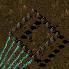

## AutoDeployDestroyers
[Factorio mod](https://mods.factorio.com/mods/slindenau/Auto_Deploy_Destroyers) by [slindenau](https://mods.factorio.com/user/slindenau)

Automatically deploys destroyer drones based on enemies around the player

This mod is for people who love fighting biters with destroyer drones, but hate having to manually throw destroyer capsules.  
This mod will automatically deploy the right amount of destroyer capsules based on how many enemies are in visibility range.  
Now you can completely focus on the battle!

For a quick overview you can watch the following mod highlight video on YouTube by JD-Plays: https://www.youtube.com/watch?v=qhDUvHGGd08

#### This mod will activate when
- You have the "Destroyer Launcher" equipment in your power armor
- You have enough destroyer capsules in your inventory (20+)
- There are biters within visibility range (30 tiles)
- Your current follower count is running below the target

#### Features include
- New technology & power armor equipment
- Automatic and instantaneous deployment of destroyer drones
- Target amount of destroyers based on simple biter weight function
- Will keep your follower count at the desired target, with minimal wastage of capsules
- Will consume capsules from the following inventories: vehicle trunk and main inventory (in that order, if available)
- Will warn you if it used your last capsules (up to a lower limit). This gives you time to retreat and restock.
- Custom deploy patterns, just for fun.