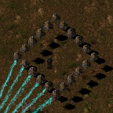

## AutoDeployDestroyers
[Factorio mod](https://mods.factorio.com/mods/slindenau/Auto_Deploy_Destroyers) by [slindenau](https://mods.factorio.com/user/slindenau)

Automatically deploys destroyer, defender or distractor drones based on enemies around the player

  

This mod is for people who love fighting biters with drones, but hate having to manually throw their capsules.  
This mod will automatically deploy the right amount capsules based on how many enemies are in visibility range.  
Now you can completely focus on the battle!

For a quick overview you can watch the following mod highlight video on YouTube by JD-Plays: https://www.youtube.com/watch?v=qhDUvHGGd08

#### This mod will activate when
- You have the "[Destroyer/Defender/Distractor] Launcher" equipment in your armor grid
- You have enough capsules in your inventory (20+)
- There are biters within visibility range (30 tiles)
- Your current follower count is running below the target

#### Features include
- New technology & armor equipment
- Automatic and instantaneous deployment of destroyer, defender or distractor drones
- Target amount of drones based on simple biter weight function
- Will keep your follower count at the desired target, with minimal wastage of capsules
- Will consume capsules from the following inventories: vehicle trunk and main inventory (in that order, if available)
- Will warn you if it used your last capsules (up to a lower limit). This gives you time to retreat and restock.
- Will recall bots back into capsules in your inventory when the battle is over (if they have 50% or more lifetime left, configurable).
- Custom deploy patterns, just for fun.

#### In-game settings include
- `Aggression factor`: determines how many drones are deployed depending on the enemies around the player
- `Minimum amount of capsules remaining`: when should auto deploy stop (defaults to 20 capsules)
- `Maximum accepted "wastage" of capsules`: if the mod should wait until you need 5 more drones (1 capsule) to deploy that capsule (or if 4, 3 etc. is also acceptable). Configured as a whole number, that defaults to 1; meaning a capsule will be deployed when 4 more drones are needed. Default totals per capsule are 5 for Destroyers, 3 for Distractors and 1 for Defenders.
- `Strict Launcher`: if a Destroyer launcher should only launch destroyers, or also previous bot types. Same for Defender and Distractor. Priority for 'previous' is Destroyer -> Defender -> Distractor.
- ... see the in-game "mod settings" menu for more!

#### Upgrade milestones
- Also works in multiplayer as of version 0.1.6
- Implemented mod settings as of version 0.1.8
- Added defenders and distractors as of version 2.1.0

### Frequently Asked Questions

#### How does this mod work / why is nothing happening?
Check if the following steps have been made:
- Research the new technology added by this mod
- Create the armor equipment unlocked by the research
- Put the equipment in the grid of your (active) personal armor
- Have more than 20 capsules in your inventory (number can be changed in mod settings)
- Engage in battle with biters; the capsules should now be launched

#### Can the equipment be used in autonomous vehicles?
No, this mod is centered around players controlling a character in the world. The equipment must be in the grid of this character's armor. Vehicles with equipment grids like the Spidertron or (modded) Trains are not supported.

If the character is driving a vehicle, this mod will continue to work with the equipment in the armor of the player. In that case capsules will also be used from the inventory of the vehicle.

#### Can this mod be used in multiplayer?
Yes

#### Why are bots not (all) recalled back to inventory?
A capsule must be fully filled for recall to work, and the bots must still have over half their lifetime (configurable %) left.
So it is possible that a few bots, or those that are too old, can no longer be recalled.